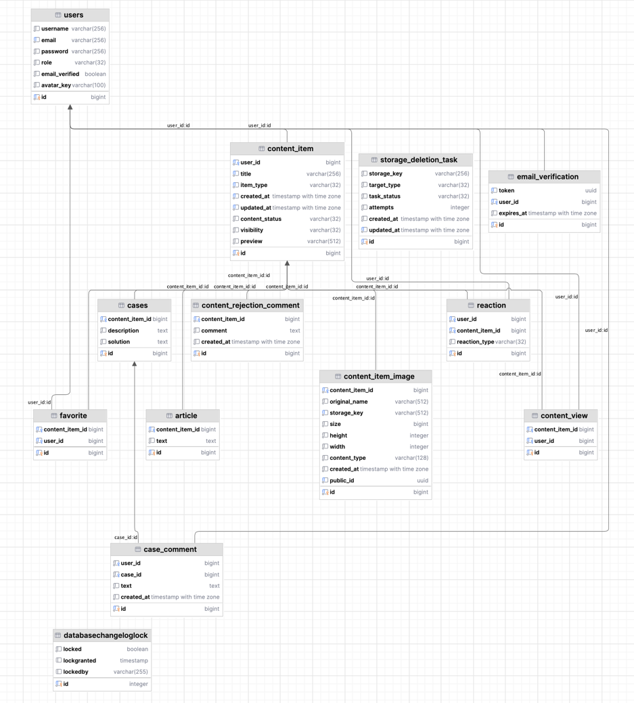

# SDevPoint

Платформа для обмена знаниями между разработчиками. Пользователи публикуют статьи в формате Markdown и кейсы в формате «проблема — решение» с возможностью обсуждения. Включает модерацию контента, AI-суммаризацию, загрузку изображений и email-верификацию.

## Основные возможности

- публикация технических статей в Markdown с предпросмотром;
- создание кейсов (проблема + решение) с обсуждением в комментариях;
- модерация контента администратором (approve/reject с комментариями);
- загрузка изображений для вставки в Markdown-текст;
- AI-суммаризация статей и объяснение терминов (DeepSeek / OpenRouter);
- реакции (like/dislike) и избранное;
- ролевая система (ROLE_USER / ROLE_ADMIN);
- email-верификация при регистрации;
- Rate Limiting для AI-запросов и отправки писем;
- кеширование AI-ответов через Redis;
- автоматическая очистка черновиков и неиспользуемых изображений;
- приватный и публичный контент.

https://github.com/user-attachments/assets/eed6ee26-1946-4435-ba26-a755914208d2


## Жизненный цикл контента

```
DRAFT → PENDING_REVIEW → PUBLISHED / REJECTED → (edit) → PENDING_REVIEW
```

Пользователь создает черновик, заполняет текст и публикует. Контент попадает на модерацию администратору. После одобрения — публикуется. При отклонении — пользователь видит причину и может отредактировать контент.

https://github.com/user-attachments/assets/8d719041-ab73-4980-bb95-2cc8e9558431


## Архитектура

Монолитное Spring Boot-приложение с серверным рендерингом страниц на FreeMarker и частичным AJAX/REST API.

### Слои приложения

- **Controller** — два типа: `PageController` возвращает HTML через FreeMarker, `Ajax/REST Controller` — JSON для асинхронных запросов;
- **Service** — бизнес-логика CRUD, модерация, AI-интеграция, загрузка изображений, email;
- **Repository** — Spring Data JPA + кастомные JPQL-запросы;
- **Entity** — JPA-сущности, связи через `@OneToOne`, `@ManyToOne`, `@OneToMany`;
- **DTO / Mapper** — отделение внутренней модели от API-контрактов;
- **Security** — Spring Security form login, `@EnableMethodSecurity`, BCrypt;
- **Exception Handler** — глобальные обработчики для page- и ajax-запросов.

### Ключевые модули

- **AI Clients** — интерфейс `AiClient` с имплементациями для DeepSeek и OpenRouter, Rate Limiting через Redis (`CooldownStore`, `WindowRateLimitStore`);
- **Image Storage** — интерфейс `ImageStorage`, реализация `InMemoryImageStorage` (локальная файловая система), асинхронная очистка неиспользуемых изображений через `StorageDeletionTask`;
- **Scheduled Tasks** — `@Scheduled` задачи: удаление просроченных черновиков, удаление файлов по расписанию;
- **Email** — async отправка через `@Async("emailTaskExecutor")`, FreeMarker-шаблоны писем, повторная отправка с cooldown и rate limit.

## Стек технологий

- **Java 25**, **Spring Boot 4.0.5**
- **Gradle** (Kotlin DSL)
- **PostgreSQL 17** (Liquibase миграции)
- **Redis 7** (кеширование + rate limiting)
- **Spring Security** (form login, BCrypt)
- **FreeMarker** (шаблоны страниц и писем)
- **Flexmark + Jsoup** (рендеринг Markdown → безопасный HTML)
- **OkHttp3** (HTTP-клиенты к DeepSeek / OpenRouter API)
- **Spring Mail** (Gmail SMTP)
- **SpringDoc OpenAPI** (документация API)
- **OpenAPI Generator** (генерация image API из спецификации)
- **Docker** (multistage build, docker-compose для dev и prod)

## Модель данных



Основные сущности:

| Сущность | Описание |
|---|---|
| **User** | Пользователь платформы, связь 1:1 с EmailVerification |
| **ContentItem** | Полиморфный контейнер для статей и кейсов (статус, видимость, владелец) |
| **Article** | Связь 1:1 с ContentItem, Markdown-текст статьи |
| **Case** | Связь 1:1 с ContentItem, описание проблемы + решение |
| **CaseComment** | Комментарий к кейсу |
| **Reaction** | LIKE/DISLIKE на ContentItem (уникальная пара user + content) |
| **Favorite** | Избранное (уникальная пара user + content) |
| **ContentItemImage** | Изображение, привязанное к контенту |
| **EmailVerification** | Токен подтверждения email с expiry |
| **ContentRejectionComment** | Причина отклонения контента модератором |
| **StorageDeletionTask** | Задача на асинхронное удаление файлов |

### Индексы

| Индекс | Таблица | Назначение |
|---|---|---|
| `idx_unique_draft_user_by_item` | `content_item` | UNIQUE, гарантирует один черновик на пользователя для типа контента |
| `idx_content_item_visibility` | `content_item` | Поиск опубликованного контента по статусу, типу и видимости |
| `idx_content_item_pending_review_created_at` | `content_item` | Пагинация контента на модерации |
| `idx_content_item_empty_draft_created_at` | `content_item` | Очистка пустых черновиков по дате создания |
| `idx_content_item_draft_created_at` | `content_item` | Очистка сохраненных черновиков по дате обновления |
| `idx_content_item_image_content_item_id` | `content_item_image` | Поиск изображений по ID контента |
| `idx_case_comment_created_at_case_id` | `case_comment` | Сортировка комментариев кейса по дате |
| `idx_storage_task_active_updated_at` | `storage_deletion_task` | Выборка активных задач на удаление |

Уникальные ограничения на уровне колонок: `User.email`, `EmailVerification.token`, `ContentRejectionComment.content_item_id`.

## AI-интеграция

AI-функции доступны владельцам контента:

- **Суммаризация** — краткое содержание статьи (до 20K символов текста). Результат кешируется в Redis (TTL 1 час). Лимит: 10 запросов в день, cooldown 1 минута.
- **Объяснение термина** — объяснение выделенного фрагмента (до 12K символов). Лимит: 30 запросов в день, cooldown 30 секунд.

Две реализации AI-клиента через интерфейс `AiClient`:
- **DeepSeek** (по умолчанию)
- **OpenRouter**

## Безопасность

- Form login (email + пароль);
- BCrypt-хеширование паролей;
- CSRF-защита;
- `@EnableMethodSecurity` для method-level авторизации;
- Email-верификация при регистрации (UUID-токен, срок 15 минут, async отправка);
- Кастомные страницы ошибок (400, 403, 404, 500).

[](https://github.com/user-attachments/assets/0872dd56-49e7-459c-bbd6-675b89d93131)

## Docker

Проект использует multistage Docker-сборку и два docker-compose файла для разных окружений.

### Dockerfile

Сборка приложения происходит в несколько этапов.
Разделение слоев зависимостей и исходного кода позволяет переиспользовать кеш — при изменении кода зависимости не скачиваются заново.

### docker-compose.yaml (dev)

Только инфраструктура для локальной разработки — PostgreSQL 17 и Redis 7. Приложение запускается отдельно через IDE или `./gradlew bootRun`.

### docker-compose-prod.yaml (prod)

Полный стек: приложение + PostgreSQL 17 (Alpine) + Redis 7 (Alpine). Все сервисы на общей сети `my_network`. Health checks для БД и Redis с `interval: 30s`, `retries: 5`. Redis запускается с `--appendonly yes --maxmemory 256mb --maxmemory-policy allkeys-lru`. Volume для хранения изображений пробрасывается с хоста.

## Конфигурация

Настройки через `.env` файл (импортируется в `application.yaml`):

| Переменная | Описание |
|---|---|
| `DB_URL`, `DB_USERNAME`, `DB_PASSWORD` | Подключение к PostgreSQL |
| `REDIS_HOST`, `REDIS_PORT` | Подключение к Redis |
| `MAIL_USERNAME`, `MAIL_PASSWORD` | Gmail SMTP |
| `DEEPSEEK_API_KEY` | API-ключ DeepSeek |
| `OPENROUTER_API_KEY` | API-ключ OpenRouter |
| `BOOTSTRAP_ADMIN_*` | Автосоздание администратора при старте |
| `IMAGE_STORAGE_PATH` | Путь к хранилищу изображений |
| `APP_BASE_URL` | Базовый URL приложения |

Пример в `.env.dist`.
